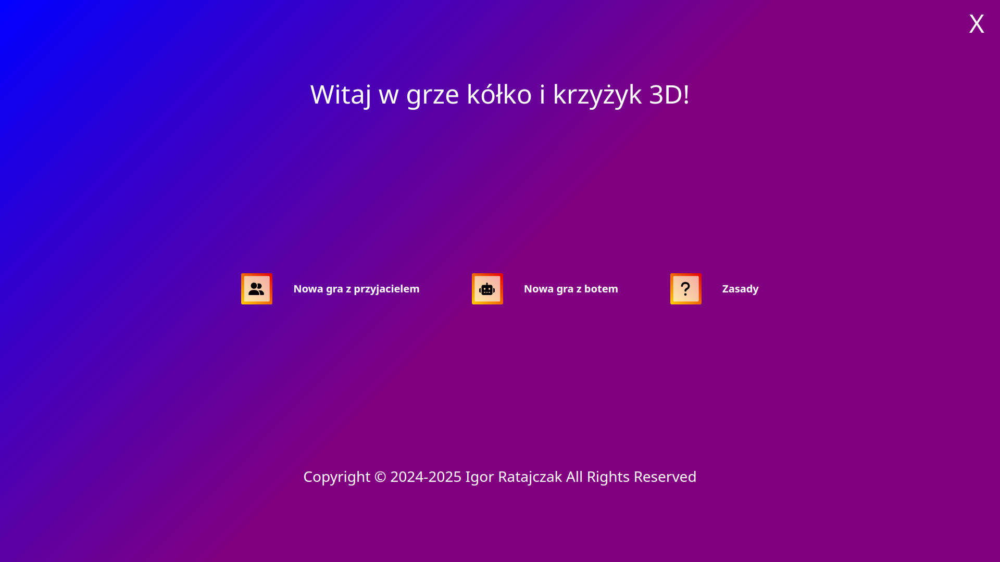
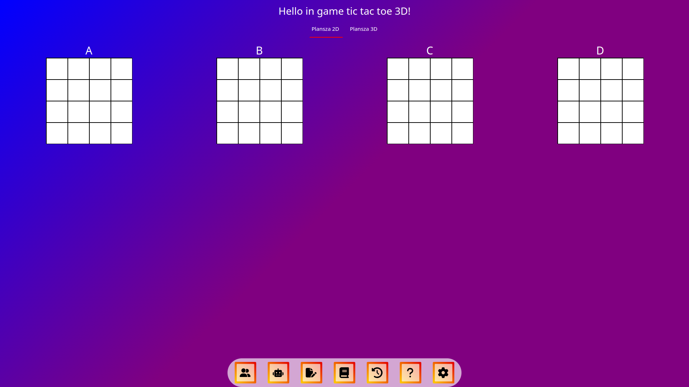
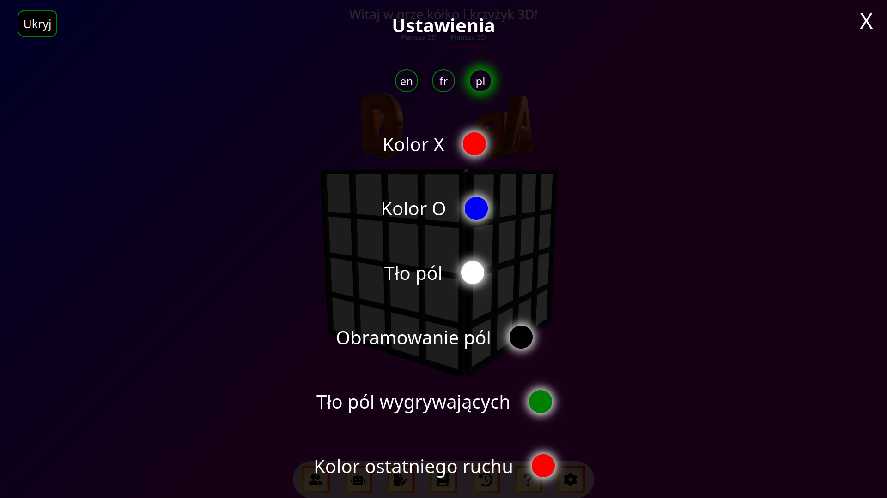
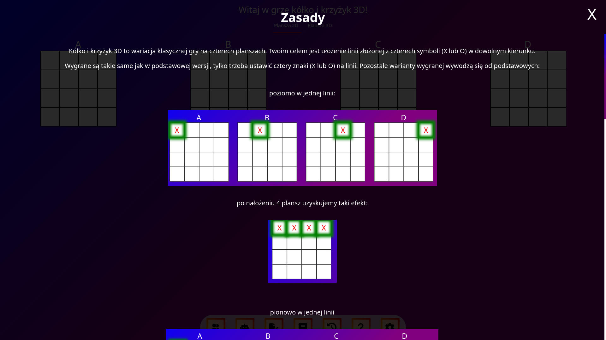

# Tic Tac Toe 3D

3D Tic Tac Toe is a variation of the classic game played on four boards. Your goal is to create a line of four symbols (
X or O) in any direction.

## Live Demo

Check out the live version here: [Live Demo](https://igor-ratajczak.github.io/tic-tac-toe-3d/)

## Screenshots

| Welcome Screen                                        | Gameplay                                     |
|-------------------------------------------------------|----------------------------------------------|
|    |    |
| Settings                                              | Rules                                        | 
| ----------------------------------------------------- | -------------------------------------------- |
|          |   |

## Demo Video

Click to show

## Why?

I wanted to make this site as a first step in learning about bots and AI and I take **Tic Tac Toe 3D** to build game and
share for everyone.  
Recently, however, I discovered **Svelte** and since I liked it, I wanted to learn it through practice.
I didn't know what website to make, because this one was supposed to be made using **Vue**.
When I saw that there was a competition [Svelte Hack 2024](https://hack.sveltesociety.dev/2024), I changed my mind and
started creating this website using
**Svelte 5**. Thanks to this, I combined learning **Svelte** with learning about bots,
and it's always nice to participate in such a competition :).

## Features

- **2D and 3D Boards** because the title says '3D' must be 3D board.
- Three AI difficulty levels: **Easy**, **Medium**, and **Hard**
- **Local multiplayer** mode for two players
- Offline work
- Automatic game saving after every move
- Ability to **save and load games**
- Detailed **game history** with replay functionality
- Customizable settings:
    - Choose the first player
    - Set bot's symbol (X or O)
- Fully **responsive design** for desktop and mobile (I hope so)

## Technical Overview

### Used Svelte Features

- I use **Svelte Runes**:
    - **$state** for managing game states (e.g game settings).
    - **$effect** very help full for update global state or game on boards.
- I add transition and :in :out for e.g. windows opening and closing.
- I use **@render** to all windows and all icons in menu because why repeat the same code?
- To create 3D board I use **Threlte** library which is the best 3D library for **Svelte**.

### Bot Logic

<h5> 
Initially I planned to use the minimax algorithm, but even on my computer the page would hang, not to mention the phone, so instead I implemented a non-standard solution:
</h5>

- The bot generates an array of all **possible winning combinations** currently available on the board.
- It "sees" potential wins and can block or prioritize its moves accordingly.
- The bot evaluates moves based on the number of times they appear in potential winning combinations.

<h5>
Thanks to this solution, the bot has no chance of making a stupid mistake, 
but of course I added a random selection whether the bot should play the best move or any move:
</h5>

- easy => 20% chance to play any move
- medium => 8% chance to play any move
- hard => 0% chance to play any move, in short the best bot

Why these percentages? Because **Math.random** use pseudo random number generator and a number below 50 is more
likely
to appear than a number above 50.

### State Management

- I use **Svelte Runes** for managing game states (e.g game settings).
- Game history and settings and all are stored in **localStorage**.

## License

This project is open-source and licensed under the MIT License.